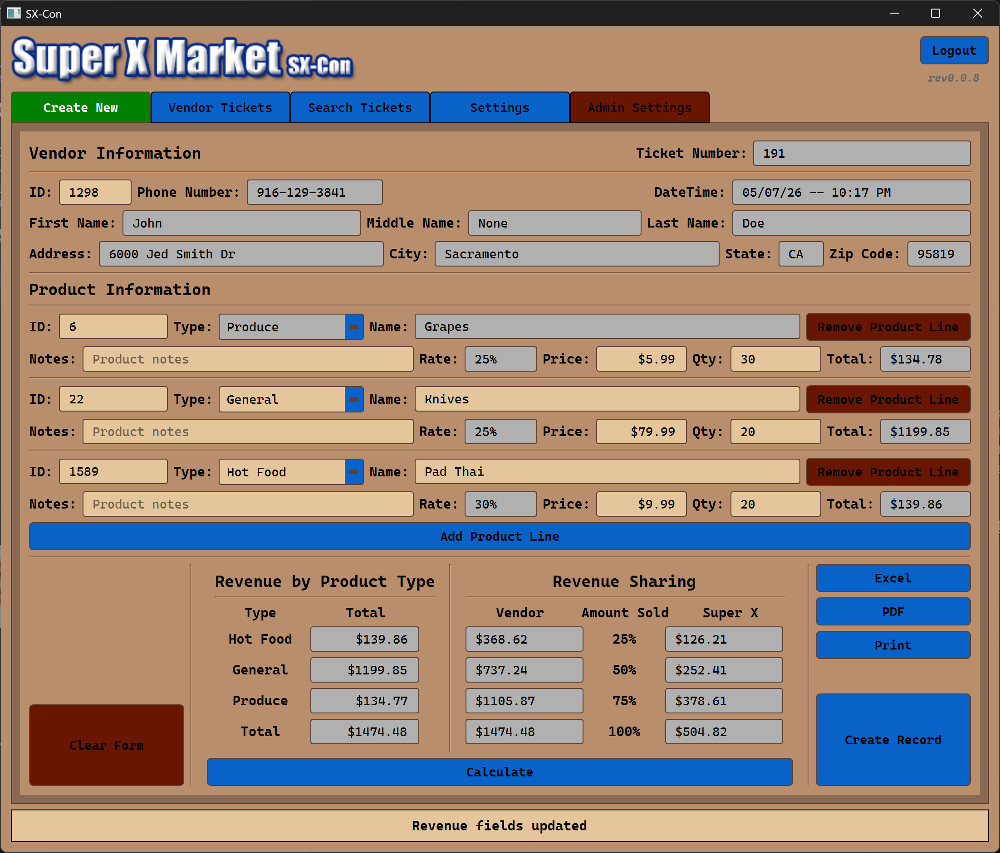

<center>

  <h1>SX-Con</h1>
  <p>
    Consignment Content Management System.
  </p>

[](https://github.com/ifndefy/SX-Con/graphs/contributors)
[](https://github.com/ifndefy/SX-Con/commits/integration/)
</center>

<hr>

# Table of Contents
- [About the Project](#about-the-project)
  * [Development Tech Stack](#Development-Tech-Stack)
  * [Features](#Features)
- [Installation](#Installation)
  * [Prerequisites](#Prerequisites)
  * [Program Setup](#Program-Setup)
  * [Database Configuration](#Database-Configuration)
- [User Manual](#usage)
- [Testing](#testing)
- [Third Party Components](#third-party-components)
- [Contact](#contact)

<hr>

# About the Project
SX-Con is a desktop application designed for Super X Market to manage Consignment data.
The application provides a user-friendly interface for CRUD actions.
The multitab setup provides for a snappy user interface to reduce time spent in the consignment process.
The program offers both online and offline modes where consignments made in offline mode can be uploaded to the online database once there is network access.



## Development Tech Stack

- **Language:**
  - Python v3.11.9
- **IDE and Tools:**
  - Atlassian Confluence
  - Atlassian JIRA
  - Jetbrains Pycharm Professional
  - poetry = "2.2.1"
- **Frontend:**
  - pyqt6 = "6.10.0"
- **Backend:**
  - azure-core = "1.36.0"
  - azure-cosmos = "4.14.2"
  - bcrypt = "5.0.0"
  - openpyxl = "3.1.5"
  - pandas = "3.0.0"
  - pywin32 = "310"
  - reportlab = "4.4.0"

## Features
- **Aggregate Data**:
    - Average price of a product
    - Last price used for a product
    - Last consignment rate used of ra product
- **Auto-generated Fields**:
    - ticket numbers and timestamps
    - Vendor Auto Population triggered from the vendor id or phone number fields
    - Product Auto Population triggered from the product id or product name fields
- **Content Management**: Create and manage consignment records
    - User input data is stored in Azure Cosmos NoSQL Database.
- **Login Authentication**: login credentials are hashed and stored
    - Passwords are hashed using bcrypt algorithm and stored along with usernames in Azure database to protect user information
- **Multi-tab Interface**: Separate tabs for Create New, Vendor Tickets, Search Tickets, Settings, and Admin Settings
    - User Interface is minimal, clean, and modernized using tabs to quickly move through the windows
- **Individual Payout Data**: consignments can be created through compound payouts
- **Revenue Sharing**: Calculate revenue distribution
    - group by product type
    - group by potential revenue quartiles
- **Linear Consignment generation**:
  1. PDF generation
  2. Physical print
  3. Database upload

<hr>

# Installation
## Prerequisites
- Python v3.11.9
  * Install using the following link: <a href="https://www.python.org/downloads/release/python-3119/">here</a>

- Poetry v2.2.1
```powershell
pip install poetry==2.2.1
```

## Program Setup
1. Clone the repository
```powershell
git clone https://github.com/ifndefy/SX-Con.git
```

2. Setup the dependencies
- Navigate inside of the cloned repo then enter the following command:
```powershell
poetry install
```

3. Setup the `config.ini` file as guided below.

## Database Configuration
The following instructions can also be found in the user manual with image guidance.<br><br>
Link the program with the Azure Cosmos NoSQL database using the following guide:<br>
The connection method will look for the config.ini in services directory<br>
1. Create `services/config.ini` with the following structure:

```ini
[Cosmos Connection Parameters]
endpoint = your-cosmos-endpoint
database_name = your-database
key = your-cosmos-key
```

Log into the Azure portal and navigate to the "Overview" page
2. From the "Overview" page, locate and copy the "URI" value
3. In the `config.ini` file, paste the URI as the value of `endpoint`
```ini
[Cosmos Connection Parameters]
endpoint = {URI} <--
database_name = your-database
key = your-cosmos-key
```
Navigate to the `Data Explorer` page in the portal
4. Locate and copy the name of the database
5. In the `config.ini` file, paste the database name as the value of `database_name`
```ini
[Cosmos Connection Parameters]
endpoint = {URI}
database_name = {DB_NAME} <--
key = your-cosmos-key
```
Navigate to the `Keys` page nested under `Settings`
6. Locate and copy the `PRIMARY KEY` value
7. In the `config.ini` file, paste the primary key as the value of `key`
```ini
[Cosmos Connection Parameters]
endpoint = {URI}
database_name = {DB_NAME}
key = {PRIMARY_KEY} <--
```
8. Save the file

# Usage
The developer documented user manual can be found via the following link: <a href='https://github.com/ifndefy/SX-Con/blob/integration/src/documents/user_manual.pdf'>User Manual</a><br>
The developer documented maintenance manual can be found via the following link: <a href='https://github.com/ifndefy/SX-Con/blob/integration/src/documents/maintenance_manual.pdf'>Maintenance Manual</a>

# Testing
The test framework is self-contained and can be activated using a single command after setup.<br>
1. Install pytest
```powershell
pip install pytest==9.0.2
```
2. Execute the automated tests
```powershell
pytest -s -v
```

The pytest module will look through the repository for all files with `test` either at the beginning or end of the name<br>
Then it will look through the file for all methods with `test` either at the beginning or end of the name and execute them<br>
Should the user only want to execute a specific file, use the following command:
```powershell
pytest {file.py} -s -v
```

# Third Party Components
SumatraPDF executable is used to guarantee the ability to render PDFs to enable printing:<br>
- https://github.com/sumatrapdfreader/sumatrapdf

# Contact
- Alexander Bubienko, alexanderbubienko@csus.edu
- Colin Heinselman, cheinselman@csus.edu
- Colin Henderson, colinrhenderson@csus.edu
- Maksym Komarov, mkomarov@csus.edu
- Joe Lee, joeslee@csus.edu
- Tim Liu, timliu@csus.edu
- Tyler Slagboom, tylerslagboom@csus.edu
- Kyle Valdez, cvaldez3@csus.edu
