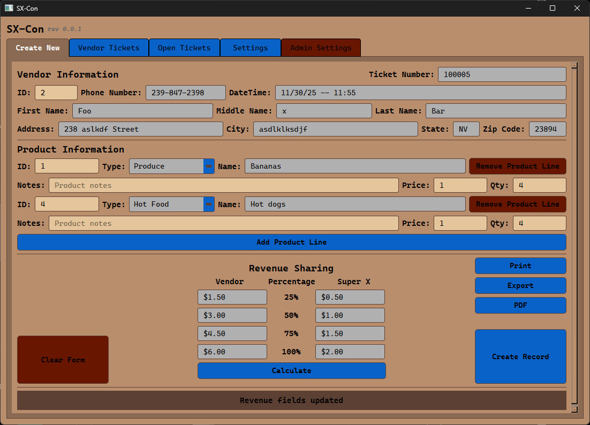
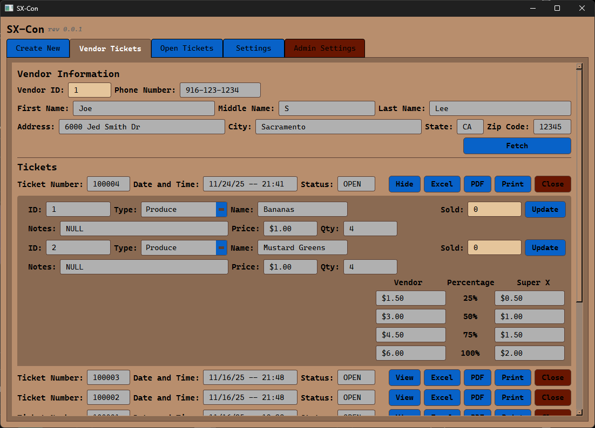
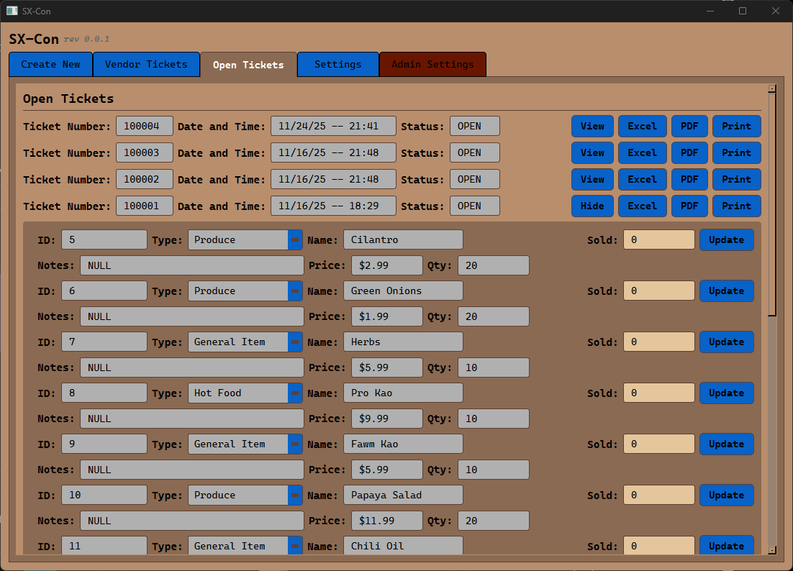
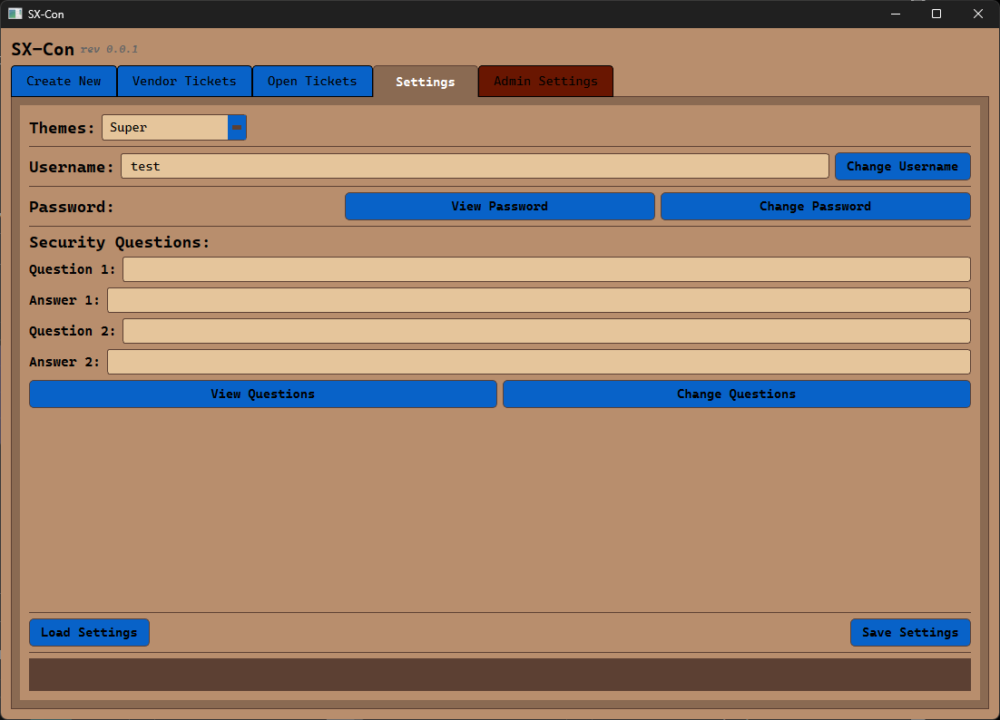
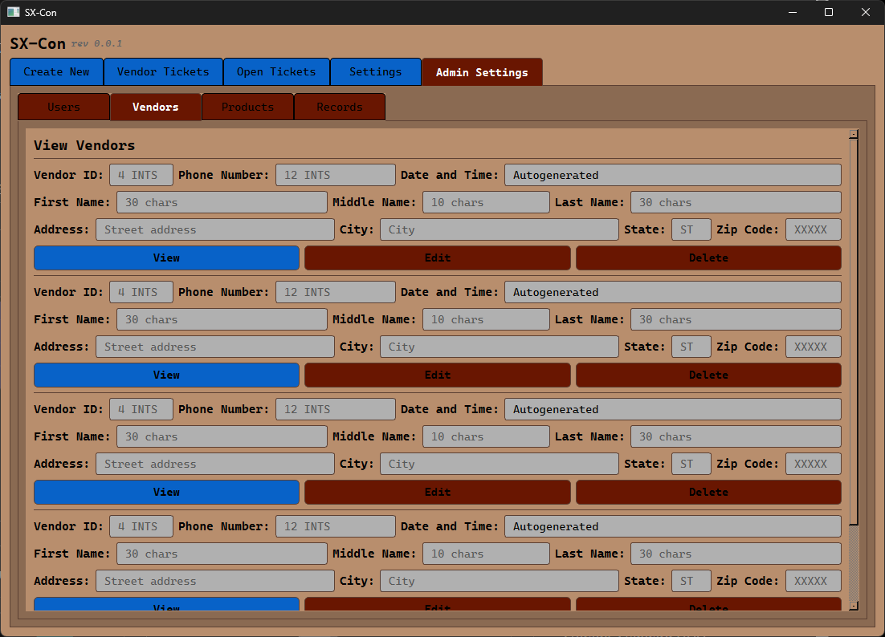

<!--
SX-Con - Vendor Management System
A comprehensive application for managing vendor records, products, and revenue sharing.
-->

<div align="center">

  
  
  <h1>SX-Con</h1>
  
  <p>
    Content Management System to streamline and automate our client's Consignment process.
  </p>
  
<!-- Badges -->
[](https://github.com/ifndefy/SX-Con/graphs/contributors)
[](https://github.com/ifndefy/SX-Con/commits/integration/)
[](https://github.com/ifndefy/SX-Con/network/members)
[](https://github.com/ifndefy/SX-Con/stargazers)
[](https://github.com/ifndefy/SX-Con/issues/)
[](https://github.com/ifndefy/SX-Con/blob/integration/LICENSE)

<h4>
    <a href="https://github.com/ifndefy/SX-Con/">View Demo</a>
  <span> · </span>
    <a href="https://github.com/ifndefy/SX-Con/issues/">Report Bug</a>
  <span> · </span>
    <a href="https://github.com/ifndefy/SX-Con/issues/">Request Feature</a>
  </h4>
</div>

<br />

<!-- Table of Contents -->
# Table of Contents

- [About the Project](#about-the-project)
  * [Screenshots](#screenshots)
  * [Tech Stack](#tech-stack)
  * [Features](#features)
  * [Configuration](#configuration)
- [Getting Started](#getting-started)
  * [Prerequisites](#prerequisites)
  * [Installation](#installation)
- [Usage](#usage)
- [Roadmap](#roadmap)
- [License](#license)
- [Contact](#contact)

<!-- About the Project -->
## About the Project

SX-Con is a desktop application built with PyQt6 for managing Consignment data.
The application provides a user-friendly interface for creating, viewing, and managing consignment records with robust input validation and Azure Cosmos database integration.

<!-- Screenshots -->
<div align="center">

# Screenshots

## Create New Ticket


## Vendor Tickets


## Open Tickets  


## Settings


## Admin


## ERD


</div>
<!-- TechStack -->

### Tech Stack

- **Language:**
  - Python v3.11.9
- **Version Control:**
  - git
  - github
- **IDE and Tools:**
  - Atlassian Confluence
  - Jetbrains Pycharm Professional
  - Poetry
- **Frontend:**
  - Python PyQt6
- **Backend:**
  - Azure Cosmos DB SDK
  - Python bcrypt
<!-- Update the tech stack, it should list what's on the slideshow -->

<!-- Features -->
### Features

- **Multi-tab Interface**: Separate tabs for Create New, Vendor Tickets, Open Tickets, Settings, and Admin Settings
    - User Interface is reduced, cleaned, and modernized using tabs to quickly move through options
- **Login Authentication**: login credentials are hashed and stored
    - Passwords are hashed using bcrypt algorithm and stored along with usernames in Azure database to protect user information
- **Content Management**: Create and manage records with comprehensive information
    - User input data is stored in Azure Cosmos NoSQL Database. Additional features such as Cosmos actions, autogeneration, and validation are combined to manage the content.
- **Input Validation**: Robust input restrictions matching database constraints
    - Form fields enforce strict data type validation using PyQt6 validators to prevent database insertion errors. All validation matches Azure SQL database column constraints.
- **Revenue Sharing**: Calculate and manage revenue distribution
    - Implemented a button-triggered revenue calculation that derives totals from (price × quantity) and applies each percentile row (25/50/75/100) to compute gross, vendor (75%), and Super X (25%) shares
- **Azure Cosmos NoSQL Integration**: Secure cloud database connectivity
    - Cosmos NoSQL allows for minimal upkeep/scaling costs, ease of use and improved database connection latency. Secure access is guaranteed thorugh either key-based authentication.  
- **Azure Cosmos NoSQL Actions**: 
    - Azure Cosmos NoSQL gives the user ability to interact with the database (being with insert, update, delete, and get the value) with its own query language.
- **Auto-generated Fields**: Automatic ticket numbers and timestamps
    - <!-- Add feature description for autopopulations (Tyler Slagboom) -->
- **Printing**: Ticket/Traveler printing
    - Tickets are generated as PDFs for easy printing.
    - PDF layout and formatting is created using reportlab.
    - Once the PDF is generated, it is automatically downloaded to the user's machine using standard os file-handling functions.

<!-- Config Files -->
### Configuration

The connection method will look for the config.ini in services directory
Create `services/config.ini` with the following structure:

```ini
[Cosmos Connection Parameters]
endpoint = your-cosmos-endpoint
key = your-cosmos-key
database_name = your-database
container_name = your-container
```

## Getting Started

### Prerequisites
- Python v3.11.9
- Poetry v2.2.1

### Installation
1. Confirm Poetry/Python version.

```powershell
poetry --version
```

```powershell
Python --version
```

2. Enable Python environment using Poetry.

```powershell
poetry env activate
```

3. Install dependencies from `poetry.lock`.

```powershell
poetry install --no-root
```

<!-- Usage -->

## Usage
1. Open shell terminal in SX-Con root directory.
2. Enable poetry environment.

```powershell
poetry env activate
```

3. Run python script.

```powershell
poetry run python SXC.py
```

<!-- explain how to use this step by step -->

1. Upon program startup, login using credentials.
2. On home page landing, populate the fields. Required fields include VendorID, ProductID(s), Price(s), Quantity(s)
3. Click "Create Record" button to insert into database
4. Navigate through tabs for other usage. The same buttons existing on the home page also exist on the other pages, with the exception of record creation.

<!-- Roadmap -->
## Roadmap and Milestones
1. Design and Structure
2. Implement Core methods
3. Implement "Create New" tab as MVP
4. Implement CMS tabs
5. Test
6. Refine
7. Publish

## Testing

## Deployment

## Developer Instructions

<!-- Contact -->
## Contact

- Joe Lee, joeslee@csus.edu
- Maksym Komarov, mkomarov@csus.edu
- Colin Henderson, colinrhenderson@csus.edu
- Alexander Bubienko, alexanderbubienko@csus.edu
- Kyle Valdez, cvaldez3@csus.edu
- Tim Liu, timliu@csusu.edu
- Colin Heinselman, cheinselman@csus.edu
<!-- Put your name and email here -->
